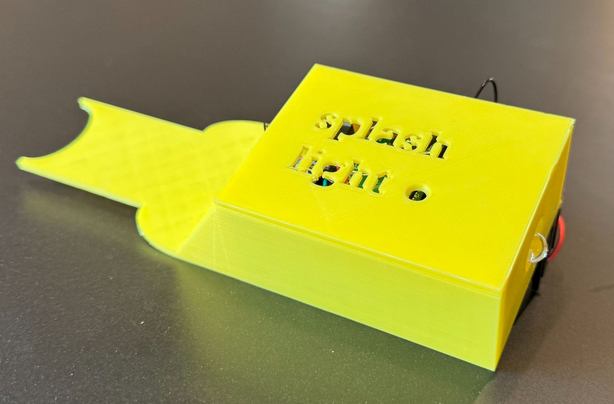

# Splash Light - Smart Bike Light Project
Welcome to the Splash Light GitHub repository! This project is a collaborative effort to create a smart bike light system that turns automatically on/off, as well as enhancing safety for cyclists. Below you will find an overview of the project, as well as how to get started with the code and hardware.

## Project Overview
For this project, we have used the ESP32-C3 microcontroller that has a built-in Wi-Fi and LoRa module. This microcontroller allows us to be able to remotely control and monitor the bike light as well as the bike itself. The bike light is designed to be energy-efficient, to extend battery life as much as possible. The code for the project is written in the Arduino programming language, which based on C/C++.
For this smart light project, the following modules are required:
- ESP32-C3 microcontroller
- Battery
- Battery charger
- Voltage regulator
- Accelerometer
- P-MOSFET
- LED light
- Photoresistor
- Buzzer
- Physical button
- Resistors

Below you can see the initial design and the final 3D-printed prototype.

<table>
  <tr>
    <td align="center"><strong>Initial Design</strong></td>
    <td align="center"><strong>Final Product</strong></td>
  </tr>
  <tr>
    <td></td>
    <td></td>
  </tr>
</table>

## Repository Structure
The repository is structured as follows, where communication team also has a subfolder for the Android app:
```
BikeProject/
├── CommunicationTeam/
|   └── AndroidApp/
├── HardwareTeam/
├── SensorTeam/
├── Main/
├── TeamDocuments/
├── LICENSE
└── README.md
```
- `CommunicationTeam/`: Contains code and documentation related to the communication aspects of the project, such as LoRaWAN downlink/uplink, as well as the code for the Android app as a zip file.
- `HardwareTeam/`: Contains code related to some of the hardware components that were required and tested for the final prototype. It also includes an example of how to use **DeepSleep** mode on the ESP32-C3, that in the end was not used in the final prototype.
- `SensorTeam/`: Contains code and documentation related to the sensors used in the project, such as the accelerometer and photoresistor.
- `Main/`: ***Contains the main code for the Splash Light***, making use of code from the Hardware, Sensor, and Communication teams. This is the code that will be uploaded to the ESP32-C3 microcontroller.
- `TeamDocuments/`: Contains documents related to the project, such as meeting notes and design plans.
- `LICENSE`: The license file for the project, which is the MIT License.
- `README.md`: This file, which provides an overview of the project and instructions on how to get started.

## Getting Started
To get started, you will need to set up the code as well as the hardware. We will provide you with a step-by-step guide on how to do both of these steps.

### Hardware Setup
To set up the hardware, you will need the components listed in the project overview. You will also need basic tools like breadboard and jumper wires to connect the components together.

### Code Setup
First of all, you need to install the Arduino IDE on your computer. You can download it from the official Arduino website: [Arduino IDE](https://www.arduino.cc/en/software/).
Next, you should install the ESP32 board package in the Arduino IDE. To do this, follow these steps:
1. In the Arduino IDE, go to File -> Preferences.
2. First, set the "Sketchbook location" to a folder containing this project.
3. In the "Additional Board Manager URLs" field, add the following URL: `https://resource.heltec.cn/download/package_heltec_esp32_index.json`
4. In the Library Manager, search for "Heltec" and install the package called "Heltec ESP32 Dev-Boards" by Heltec Automations.
5. Go to Tools -> Board -> Board Manager and select "Wireless Mini Shell".
Now you are ready to run the code in "Main.ino" from the Arduino IDE without any errors.

### How to build and run the project
To build and run the project, you will need to run the code by uploading the "Main.ino" file to the ESP32-C3 microcontroller using the Arduino IDE. Make sure you have selected the correct board and port in the Tools menu (see last section) before uploading. 
To get the android app running, you can download and extract the zip file from the `CommunicationTeam/AndroidApp` folder and install it on your Android device. The app will allow you to control the bike light and monitor its status.

## Features of Splash Light
- Automatically turns on/off based on movement and light conditions.
- Manual switch-on by button-press.
- Focus on battery life.
- Battery driven & rechargeable.
- 3D printed enclosure.
- Operates in three modes: *Active mode, Park mode, Storage mode*.
- Equipped with LoraWAN for wireless communication.
- Capable of changing operation mode from app.
- Capable of transmitting data: Geolocation & battery status.
- Has Visual (through the app) or audible warning of low-battery (<20%).

## Original Teams
- Hardware Team         (HT) Nicklas, Pepe
- Sensor Team           (ST) Julian, Oskar
- Communication Team    (CT) Gea, Edoardo (My contribution)

## License
This project is licensed under the MIT License. See the [LICENSE](LICENSE) file for details.
